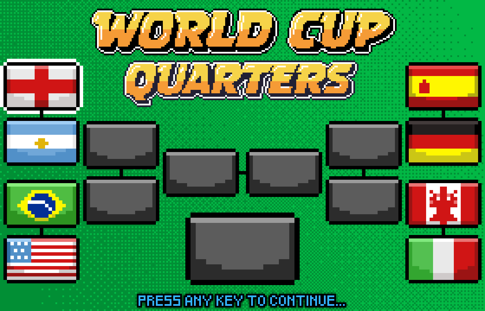

# SuperSoccer ⚽

一个使用 Godot 4.4 引擎开发的像素风格足球游戏，支持单人和双人模式，包含完整的锦标赛系统。

## 🎮 游戏特色

- **像素艺术风格**: 精美的像素艺术图形和动画
- **多种游戏模式**:
  - 单人模式 (对战AI)
  - 双人模式 (本地对战)
  - 锦标赛模式
- **9个国家队**: 包含法国、阿根廷等多个国家队，每个队伍都有独特的球员数据
- **完整的足球机制**: 传球、射门、铲球、换人等真实足球操作
- **动态音效**: 包含背景音乐和游戏音效

## 📸 游戏截图

### 主菜单


*选择单人或双人模式*

### 国家选择


*从9个国家中选择你的队伍*

### 锦标赛


*完整的锦标赛淘汰赛制*

### 比赛进行


*激烈的足球对战*

## 🎯 游戏玩法

### 基本操作

**玩家1 (WASD + JKL)**:

- `W/A/S/D`: 移动
- `J`: 射门/铲球/特殊动作(倒钩、凌空)
- `K`: 传球
- `L`: 切换控制球员

**玩家2 (方向键 + 123)**:

- `方向键`: 移动
- `1`: 射门/铲球/特殊动作(倒钩、凌空)
- `2`: 传球
- `3`: 切换控制球员

### 游戏模式

1. **单人模式**: 对战AI控制的队伍
2. **双人模式**: 两名玩家本地对战
3. **锦标赛模式**: 单人淘汰赛，挑战多个AI队伍

### 游戏机制

- **球员属性**: 每个球员都有独特的速度和力量属性
- **位置系统**: 守门员、后卫、中场、前锋四个位置
- **时间限制**: 每场比赛有固定时间，时间到后比分高者获胜
- **加时赛**: 平局时进入加时赛
- **智能AI**: AI球员具有不同的行为模式和难度

## 🛠️ 技术实现

### 开发环境

- **引擎**: Godot 4.4
- **语言**: GDScript
- **分辨率**: 280x180 (像素完美缩放)
- **渲染**: GL兼容性模式

### 架构特点

- **状态机模式**: 游戏状态、屏幕状态、玩家状态都使用状态机管理
- **事件总线**: 使用EventBus进行组件间通信
- **数据驱动**: 球员数据通过JSON文件配置
- **模块化设计**: 清晰的场景和脚本组织结构

### 核心系统

1. **游戏管理器** (`GameManager`): 管理游戏状态、比分、时间
2. **屏幕状态机**: 管理主菜单、选择界面、游戏界面切换
3. **玩家状态机**: 管理球员的移动、射门、铲球等状态
4. **AI系统**: 智能对手行为控制
5. **音频系统**: 背景音乐和音效管理

## 📁 项目结构

```tree
super_soccer/
├── assets/                 # 游戏资源
│   ├── audio/              # 音频文件
│   ├── fonts/              # 字体文件
│   ├── json/               # 数据文件 (球员信息)
│   ├── sprites/            # 精灵图片
│   └── themes/             # UI主题
├── scenes/                 # 游戏场景
│   ├── screens/            # 各个界面场景
│   ├── player/             # 球员场景
│   ├── ball/               # 足球场景
│   └── ui/                 # UI组件
├── scripts/                # 脚本文件
│   ├── auto_load/          # 自动加载脚本
│   ├── state_machine/      # 状态机实现
│   ├── ai_behavior/        # AI行为
│   └── utils/              # 工具类
└── resources/              # 资源定义
```

## 🚀 运行游戏

### 系统要求

- Godot 4.4 或更高版本
- 支持OpenGL的显卡

### 安装步骤

1. 克隆或下载项目文件
2. 使用Godot引擎打开项目
3. 点击"播放"按钮运行游戏

### 构建发布版本

1. 在Godot中选择 "项目" > "导出"
2. 选择目标平台 (Windows, Linux, macOS)
3. 配置导出设置
4. 点击"导出项目"

## 🎨 美术资源

游戏包含完整的像素艺术资源：

- 9个国家的旗帜图标
- 球员精灵动画 (不同肤色和位置)
- 足球场地和UI界面
- 粒子效果和特效

## 🔧 自定义和扩展

### 添加新国家队

1. 在 `assets/json/squads.json` 中添加新的国家数据
2. 在 `assets/sprites/flags/` 中添加对应的旗帜图片
3. 更新 `DataLoader` 中的国家列表

### 修改球员属性

编辑 `squads.json` 文件中的球员数据：

- `speed`: 球员速度 (0-100)
- `power`: 球员力量 (0-200)
- `role`: 位置 (0=守门员, 1=后卫, 2=中场, 3=前锋)

### 调整游戏平衡

在 `GameManager` 中修改：

- 比赛时长
- 球的物理属性
- AI难度设置

## 📄 许可证

本项目采用 MIT 许可证 - 查看 [LICENSE](LICENSE) 文件了解详情。

**享受游戏！⚽🎮**
